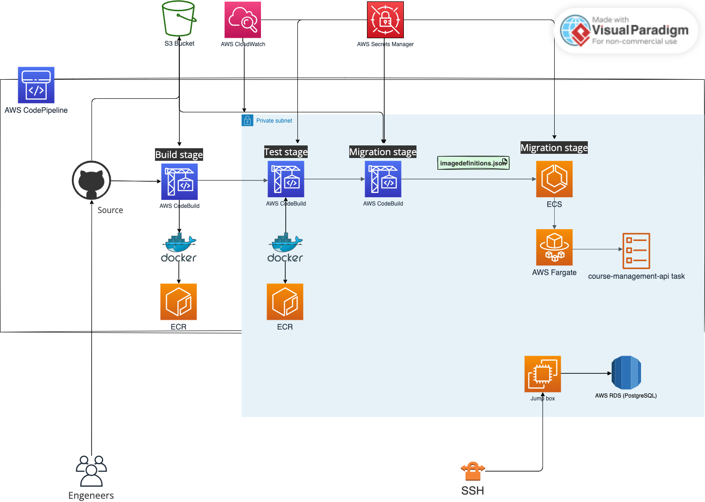

# Course-management
# Course-management
 Course Management System API is an online management application. Its main purpose is to make efficient interaction between students and instructors in college during the period of submission of assignments and for getting appropriate feedback from instructors.

# Functional requirements
- [x] [Should be functionality for registration in the system](#1-registration);
- [x] [Should be functionality for authentication and authorization in the system](#2-authentication-and-authorization);
- [x] [There are three roles: admin, instructor, student](#3-roles-and-permissions);
- [x] [Admin user should be predefined](#4-admin-role);
- [x] [Admin should be able to manage all information in the system](#4-admin-role);
- [x] [Admin should be able to assign a role for a new user](#5-assign-a-new-role-for-a-user);
- [x] [Admin should be able to assign instructor for the course](#6-assign-instructor-for-the-course);
- [x] [Student can take up to 5 courses at the same time](#7-student-can-take-up-to-5-courses-at-the-same-time);
- [x] [Each course should have at least one instructor](#8-each-course-should-have-at-least-one-instructor);
- [x] [Each course contains at least 5 lessons](#9-each-course-contains-at-least-5-lessons);
- [x] [The student should be able to upload a text file with homework](#10-the-student-should-be-able-to-upload-a-text-file-with-homework);
- [x] [The instructor should be able to put a mark for a student for each lesson](#11-the-instructor-should-be-able-to-put-a-mark-for-a-student-for-each-lesson);
- [x] [The final mark for course is average by lessons](#12-the-final-mark-for-course-is-average-by-lessons);
- [x] [The instructor should be able to give student final feedback for the course](#13-the-instructor-should-be-able-to-give-student-final-feedback-for-the-course);
- [x] [The instructor should be able to see list of his courses](#14-the-instructor-should-be-able-to-see-list-of-his-courses);
- [x] [The instructor should be able to see list of students per course](#15-the-instructor-should-be-able-to-see-list-of-students-per-course);
- [x] [The student should be able to see his courses](#16-the-student-should-be-able-to-see-his-courses);
- [x] [The student should be able to see list of lessons per course with all related information](#17-the-student-should-be-able-to-see-list-of-lessons-per-course-with-all-related-information);
- [x] [To pass the course student should get a minimum of 80% for final grade](#18-to-pass-the-course-student-should-get-a-minimum-of-80-for-final-grade);

# Technical requirements
- [x] JS/TS - TS;
- [x] Express/NestJS - NestJS;
- [x] Relational DB (PostgreSQL/MySQL) - PostgreSQL;
- [x] ORM - TypeORM;
- [x] Database migration tool - TypeORM;
- [x] Unit tests for controllers/services/DAO layers; **~90% coverage**;
- [x] e2e tests; **NOTE: Exist but not full coverage**
- [x] Totally follow REST API specification;
- [x] Token based authentication(JWT is preferable) - JWT;
- [x] API should be running inside Docker container;
- [x] Build CI/CD pipeline with Jenkins(preferable) - AWS CodePipeline + AWS CodeBuild + ECR + ECS;
- [x] Deploy your API to any cloud provider (AWS/GCP/Azure) - AWS ECS;

NOTE: Infrastructure as code implemented with Terraform. See separate repository [here](https://github.com/VladisB/course-management-api-terraform)

## Functionality description
### 1) Registration

User can register in the system by regular authentication process with `POST /auth/signup` endpoint.
Auth module described in the [Authentication](http://localhost:3000/docs#/Auth) section in swagger documentation.

Admin can create new users with `POST /users-management` endpoint.
Users management module described in the [Users Management](http://localhost:3000/docs#/Users%20management) section in swagger documentation.

### 2) Authentication and Authorization

User can authenticate in the system by regular authentication process with `POST /auth/signin` endpoint.
Auth module described in the [Authentication](http://localhost:3000/docs#/Auth) section in swagger documentation.

Authorization is based on JWT tokens. The token is generated by `POST /auth/signin` endpoint and is valid for specific time. The token is used to access protected endpoints.

### 3) Roles and permissions
There are 3 roles in the system: `admin`, `instructor`, `student`. Each role has its own permissions to access endpoints.

### 4) Admin role

Admin role predefined and set up in the database by migration. Admin can manage all information in the system except some specific cases.

### 5) Assign a new role for a user

Admin can assign a new role for a user by `PATCH /users-management/:{id}` endpoint. [Users Management](http://localhost:3000/docs#/Users%20management) section in swagger documentation.

### 6) Assign instructor for the course
Admin can assign instructor for the course by `POST /course-instructors` endpoint. [Course Instructors](http://localhost:3000/docs#/Course%20instructors) section in swagger documentation.

### 7) Student can take up to 5 courses at the same time
System handle it on the group level automatically. When student tries to enroll to the 6th course, the system will return an error.

### 8) Each course should have at least one instructor
System handle it on the group level automatically. When admin tries to create a course without instructors, the system will return an error.

### 9) Each course contains at least 5 lessons
System handle it on the group level automatically. When admin tries to create a course without lessons, the system will return an error. Course has available flag to check it.

### 10) The student should be able to upload a text file with homework
Student can upload a text file with homework by `POST /homeworks` endpoint. [Homeworks](http://localhost:3000/docs#/Homeworks) section in swagger documentation.

### 11) The instructor should be able to put a mark for a student for each lesson
Instructor can put a mark for a student for each lesson by `POST /lesson-grades` endpoint. [Lesson Grades](http://localhost:3000/docs#/Lesson%20grades) section in swagger documentation.

### 12) The final mark for course is average by lessons
The final mark for course is average by lessons. The final mark is calculated automatically by the system.

### 13) The instructor should be able to give student final feedback for the course
Instructor can give student final feedback for the course by `POST /student-courses` or `PATCH /student-courses` endpoints. [Student Courses](http://localhost:3000/docs#/Student%20courses) section in swagger documentation.

### 14) The instructor should be able to see list of his courses
Generally system has very flexible search functionality. Read courses data available for users by `GET /courses` endpoint. [Courses](http://localhost:3000/docs#/Courses) section in swagger documentation.

To see list of courses for specific instructor, use `GET {{address}}/courses/?searchBy=instructorId&search=2&sortBy=id` endpoint.

Discribing query params:
* `searchBy` - field name to search by;
* `search` - value to search;
* `sortBy` - field name to sort by;
* `sortType` - sort order, `ASC` or `DESC`;

### 15) The instructor should be able to see list of students per course

To see list of students per course, use `GET {{address}}/student-courses/?searchBy=courseId&search=1&sortBy=id` endpoint. [Student Courses](http://localhost:3000/docs#/Student%20courses) section in swagger documentation.

### 16) The student should be able to see his courses

User can see his courses by `GET /students/my-courses` endpoint. [Students](http://localhost:3000/docs#/Students) section in swagger documentation.

### 17) The student should be able to see list of lessons per course with all related information

Student can get list of lessons per course with all related information by `GET /lessons` endpoint. [Lessons](http://localhost:3000/docs#/Lessons) section in swagger documentation.
Example `GET {{address}}/lessons/my?searchBy=courseId&search=1&sortBy=id` endpoint.

### 18) To pass the course student should get a minimum of 80% for final grade

System handle it automatically. When student gets a lesson marks it will recalculates the final grade for the course. Each Student course has `passed` flag to check it.

# Part I: Setting up local environment
This part describes main dependencies and tools required to be installed on your local machine to run this application. Contains a set of instructions and references to the documentation.

## Download & Install(Better use Docker setup)
### 1) Install NVM, Node.js and NPM.

NVM is a Node Version Manager for Node.js, it's used to install and manage multiple active Node.js versions. It is possible to install and use it on these particular platforms: unix, macOS and Windows.

The first step is simplest: just install NVM with the `curl` or `wget` command provided in the [documentation](https://github.com/nvm-sh/nvm). Please follow the detailed instructions and verify the installation to avoid issues further.

When NVM is installed, you can run the following command to output current nvm version.
```
nvm -v
```

To list the available remote versions of Node.js, run this command.
```
nvm ls-remote
```

Or this, if you are running on Windows 10.
```
nvm list available
```

Install a specific version of Node.js.
**Note**: `Current node version of the project is 18.17.1 (LTS)`
```
nvm install 18.17.1
```

Set the Node.js version you just downloaded.
```
nvm use 18.17.1
```

List node versions available on your local machine and validate the default you are currently using.
```
nvm ls
```

Type the command `node -v` to check your version of Node.js and `npm -v` to output Node Package Manager version installed.

### 2) Set up Docker on macOS

Of course you can run the application without Docker, but it's highly recommended to use it for development and production environments with the same configuration.
Currently Docker setup is based on `node:18.17.1` image.

1. **Download Docker Desktop for Mac**: Visit the Docker Hub website and download the Docker Desktop for Mac installer. You'll need to create a Docker Hub account if you don't have one. You can download the installer from [here](https://hub.docker.com/editions/community/docker-ce-desktop-mac/).

2. **Install Docker Desktop**: Open the installer file you downloaded (it should be a `.dmg` file). Drag and drop the Docker app icon to the Applications folder.

3. **Start Docker Desktop**: Navigate to your Applications folder and click on Docker.app to start the application. The first time you open Docker Desktop, a window will open asking for your system password to install networking components and links to the Docker apps. Enter your password and click OK.

4. **Verify the installation**: You can verify that Docker Desktop started correctly by opening a terminal and running the command `docker version`. This will display information about the installed Docker version.

Remember, Docker Desktop for Mac requires that you're running macOS Sierra 10.12 or newer. Docker Desktop will use a significant amount of disk space and memory, as it runs a virtual machine in the background to host Docker.

### 3) Clone the repository, install node packages
Repository contains 2 main branches: `main` and `develop`. Others are development lifecycle branches which might be changed or removed at any time.

The `main` branch contains stable, production ready code.

The `develop` is main development branch, which contains latest features and the most recent updates of the api code base.

Run the following commands on your local machine to clone the repository and install dependencies:
```
git clone git@github.com:VladisB/course-management.git
cd course-management
git checkout develop
npm ci
```
## Configuration
### 1) Create .env file
The `.env` file is required to define and load the environment specific variables into `process.env`.

Create a `.env` file with name regarding to you environment(`.production.env` or `.development.env`) in the root directory of a project. Add environment-specific variables on new lines in the form of `NAME=VALUE`.

**Note**: Use `.env.example` template file to fill all required values in the `.env` config file.

The full list of environment variables used in version `1.0.0`:
* `APP_PORT`
* `APP_JWT`
* `APP_ACCESS_TOKEN_EXPIRES_IN`
* `APP_REFRESH_TOKEN_EXPIRES_IN`
* `APP_UPLOAD_RATE_LIMIT_TTL`
* `APP_UPLOAD_RATE_LIMIT`
* `APP_UPLOAD_FILE_SIZE_LIMIT_MB`
* `NODE_ENV`
* `DB_TYPE`
* `PG_DATABASE`
* `PG_HOST`
* `PG_PASSWORD`
* `PG_PORT`
* `PG_USER`
* `AWS_ACCESS_KEY_ID`
* `AWS_SECRET_ACCESS_KEY`
* `AWS_S3_REGION`
* `AWS_APP_BUCKET_NAME`
* `AWS_S3_URL_EXPIRES_IN_MIN`


## Start App

### 1) Run build command
Run build command to transpile TypeScript into JavaScript. The command should exit without errors.

```
npm run prebuild;
npm run build;
```

The output artifacts will be stored in a `/dist` folder. Make sure you have a `/dist` folder in the project root directory, it shouldn't be empty.

Build containers with docker-compose:
```
docker-compose build;
```

Run containers with docker-compose in detached mode:
```
docker-compose up -d;
```

Otherways, you can run `bash ./rebuild.sh` to run all commands at once.

By default app is running on port `3000`, base local address is: [`http://localhost:3000`](http://localhost:3000/).

# Cloud infrastructure



# Swagger documentation
Swagger documentation is available on the following address: [`http://localhost:3000/docs/`](http://localhost:3000/docs/)

